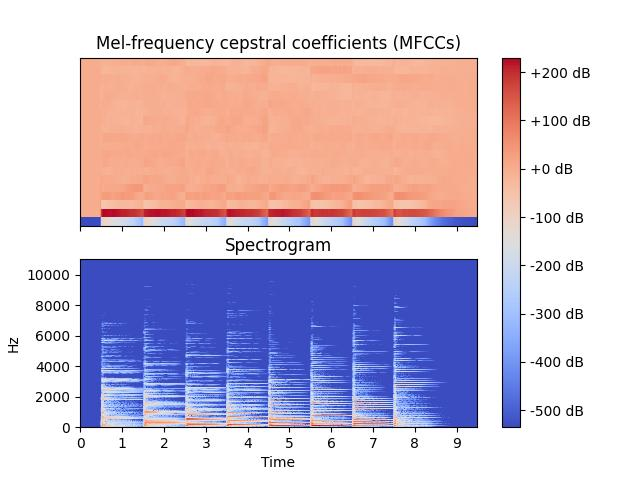
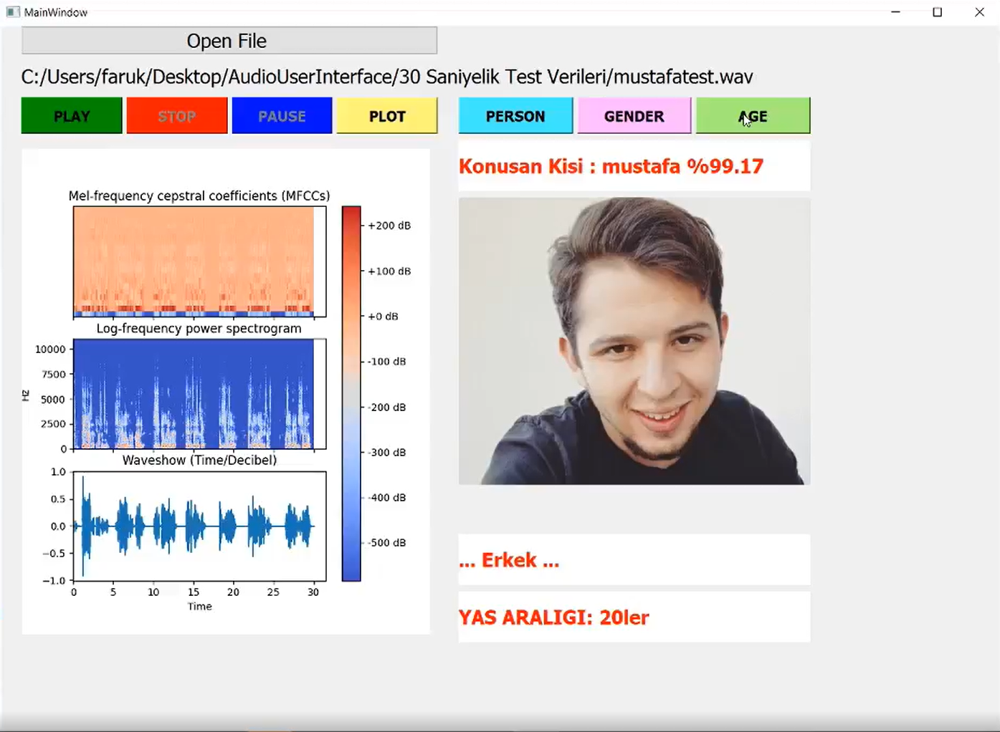

**AUDIO CLASSIFER**

* extract_data.py: Extract audio MFCC features from a given directory to train on a model.
* train.py: Create a CNN model that trains on MFCC features to classify audios.
* plot.py: Plots a two simple graphs on a given audio features.
* main.py: Main application that contains all features about audio and classification.

**This project has two main features:**

**1. To be able to see the features of an audio as a plot.**

This image has the plot features (MFCCs and spectrogram) of a scale.wav audio file

**2. To be able to extract features from an audio such as gender, identity and age.**

This image shows us the person identity and his/her photo from the database with the gender and
age interval with the plot of the person's voice's features.

